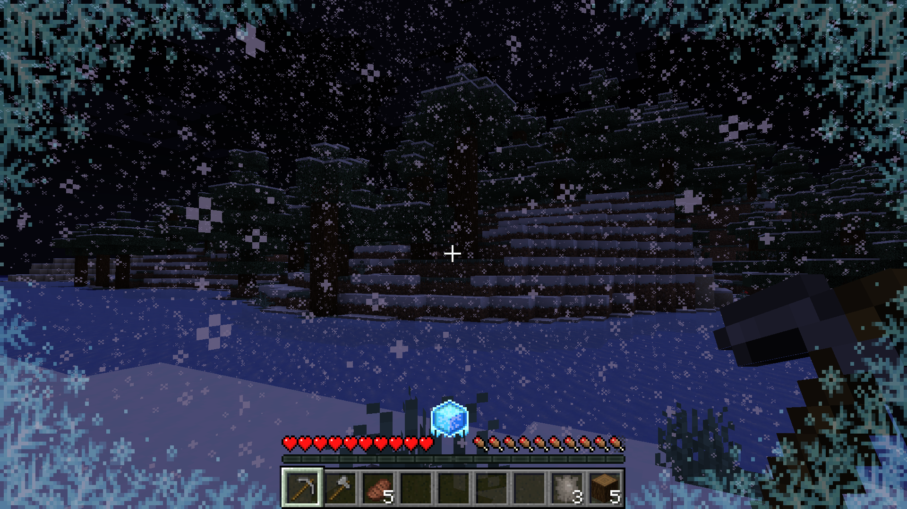
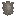

  
    

**Pyrofrost** is a temperature mod that is built to not be extremely tedious to deal with while still presenting challenges to the player's survival experience.
Unlike mods like Tough as Nails, Temperature is built to slowly transition into your environment's temperature rather than quickly transitioning to it.
Pyrofrost also features a wetness system to add an extra level of difficulty to gameplay.
This is but one of the many changes Pyrofrost provides to create an immersive temperature system.  

 

- **Wolf Fur Armor**   
  Wolf Fur Armor is a new type of armor used to provide insulation against cold environments.
  It can be crafted using the new **Wolf Pelt**  item
  which is obtained by killing wolves.
- **Netherite Armor**  
  Netherite Armor has been enhanced with a new heat resistance ability. This is useful for traversing hot environments such as The Nether.
- **Ice Pack**   
  Ice Packs provide an early game method of traversing through hot environments, they cool down
  the environment around you until the ice completely melts making it safer to travel in hotter areas. You can use it by placing it in your offhand.
- **Thermometor**   
  The Thermometor measures your current body temperature and your environment's temperature. This only works if it is within your hotbar.

 
Pyrofrost works great with the following mods:

- **Dehydration**
  - The player will lose water faster if the environment is really hot
- **Fabric Seasons**
  - The environment's temperature will change depending on the current season